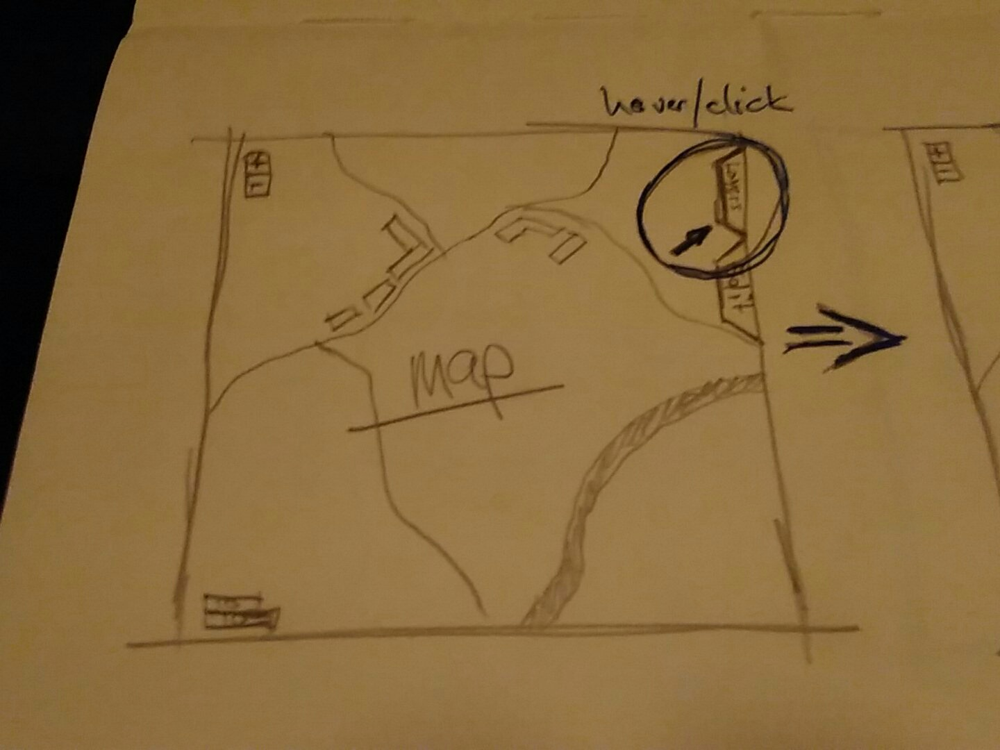
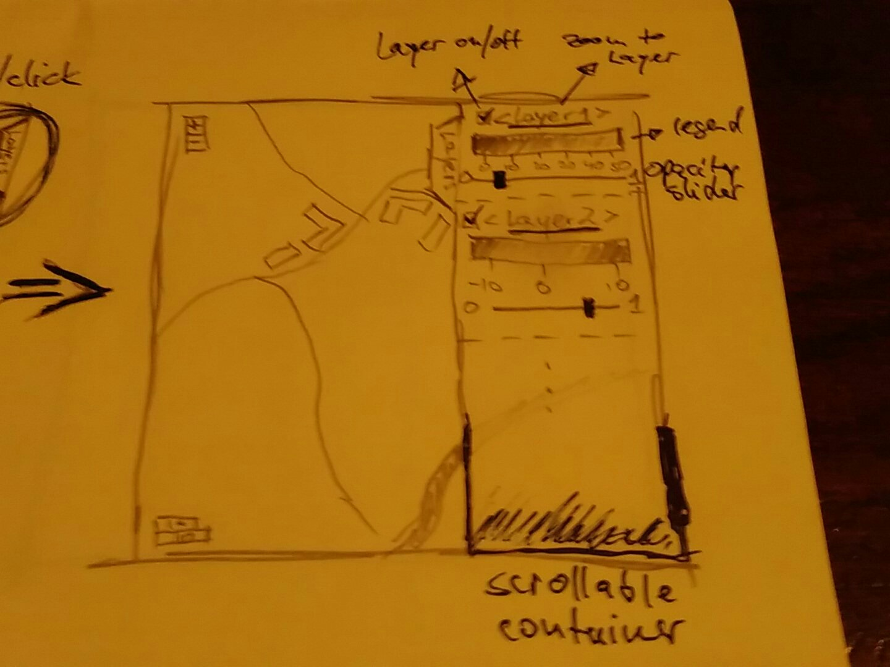

```{r setup, include=FALSE}
knitr::opts_chunk$set(echo = TRUE)
```

### mapview 

**mapview** is in its simplest regard a wrapper around **leaflet** (about 80% of its visualisations are based on leaflet).

It is intended to provide quick visual access to the currently analysed spatial data for visual inspection. As such it tries to mimic standard GIS map canvas implementations (QGIS, ArcMap, ...). So far, we have support for the following R spatial data classes:

1. all SP* classes
2. all Raster* classes
3. additionally we support **satellite** objects

It is possible to provide a list of a combination of these to render layers or add layers with `+` 
```{r layers}
library(mapview)
mapview(list(gadmCHE, poppendorf[[5]])) + breweries91
```

<br>

**One major effort currently is to also support classes provided by package sf** developed by @edzer

Regarding the key functionalities that standard GIS visualisation platforms provide, we have implemented for a simple call to `mapview()` (apart from plain panning and zooming):

1. layered views (with possibility to switch layers on and off)
2. zoom-to-layer-buttons for each layer
3. popup queries (not usually available in GIS systems)
4. a scale bar
5. mouse position information about coordinates and zoom level
6. a choice of different basemaps on which to render features
7. adding legends
8. changing opacity 
9. changing color or color mapping to attribute table columns

Depending on the feature, they are either provided by default or need to be declared in the call. For example, switching layers on and off can be done interactively by default whereas in order to change the opacity of a layer we need to reinitialise the view with the modified opacity as this can only be specified at the time of the call and needs to be set for all layers individually. Thus, with multiple layers we would end up with something like this

```{r opacity}
mapview(poppendorf[[5]], alpha = 1) + mapview(breweries91, alpha = 0.2, alpha.regions = 0.2)
```

<br>

In case you work with many layers this quickly becomes ridiculously involved. On top of this legends are supported by leaflet but they are added to the view by brute force so that for many layers there is simply not enough physical space on the map canvas to display them. 

This calls for a different approach to control layers interactively. The solution I am proposing here is again trying to mimic standard GIS solutions where a portion of the view is dedicated to controlling everything you see on the map. This is usually achieved by dividing the map canvas window into a display and a control part where every control option is located. From there you can switch layers on and off, change their appearance and order, define colors and opacity and get meta information for each layer. It is very desirable to have something similar for mapview/leaflet! Here's an amateur graphical depcition of what this could look like for leaflet/mapview:



<br>



<br>

This is a rough first idea of what a proper 'GIS-like-control' could look like. 

It would provide

1. layer on/off
2. zoom-to-layer
3. the legend
4. a slider to control layer opacity
5. ...

in a scrollable container so that all layers can be modified, even if there are many.

**Any input regarding this is highly encouraged and more than welcome** (in addition to the depicted functionality, @mdsumner already suggested an 'Alt-click' action to reveal the metadata of the layer).

To implement something like this we would first need to create a working **leafletjs** plugin which we can then bind to leaflet/mapview. As this is not a trivial task and we (as in the creators of mapview) have not enough background in JavaScript we are looking for people who would feel comfortable to implement this on the JS side and possibly also provide proper bindings to R. 
